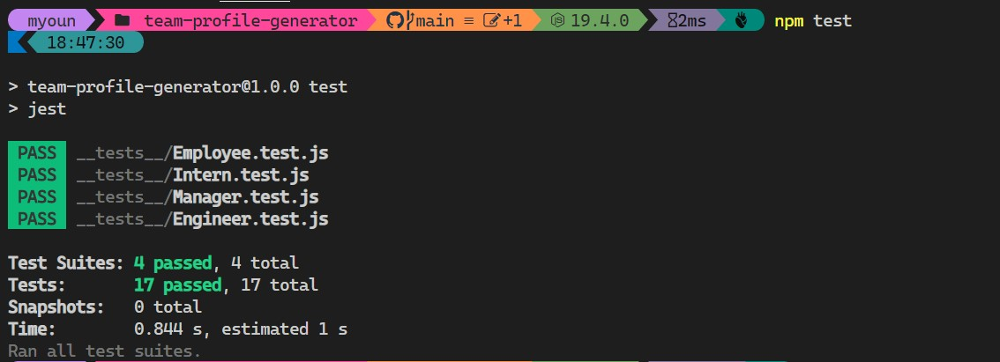
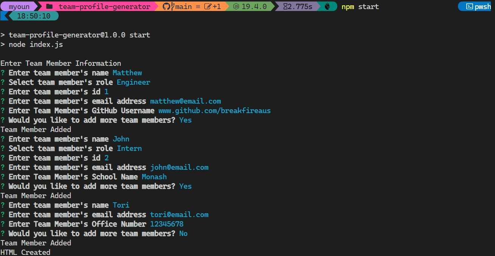
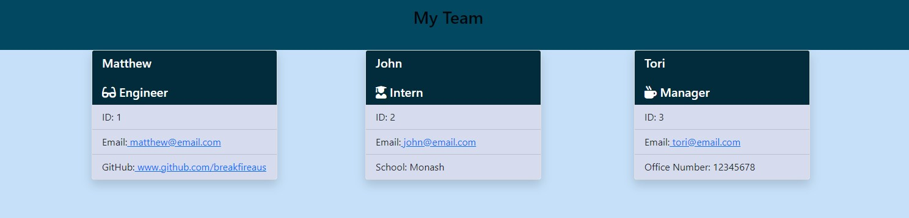

# Title

Team Profile Generator

## Description

Welcome to the team profile generator, this uses the Command line interface to create your team on a html page using Object oriented Programming, this was a challenging as had to learn how to use Jest, and inquirer, read the docs, and wrote my code, bugs were in the program but got it working.

## Table of Contents

- [Installation](#installation)
- [Usage](#usage)
- [Credits](#credits)
- [License](#license)

## Installation

1. Download the github repo from https://github.com/breakfireaus/team-profile-generator.git
2. git clone https://github.com/breakfireaus/team-profile-generator.git
3. npm test, to start the tests
4. npm start, to start the CLI interface(the program)

5. Video to show how to use program and test
   https://drive.google.com/file/d/1rK84GXwmJzWQGzIjrOM0CVUoaKt05pto/view

## Usage

- Test CLI(type: npm test to run jest)
  

- Program CLI(type: npm start to run program) which will node index.js
  

- HTML screenshot of what produced by program CLI
  

- Video to show how to use program and test
  https://drive.google.com/file/d/1rK84GXwmJzWQGzIjrOM0CVUoaKt05pto/view

## Credits

- Ask BCS team @ Monash university Bootcamp
- Tutor for getting me on track

## License

MIT License

Copyright (c) 2023 breakfireaus

Permission is hereby granted, free of charge, to any person obtaining a copy
of this software and associated documentation files (the "Software"), to deal
in the Software without restriction, including without limitation the rights
to use, copy, modify, merge, publish, distribute, sublicense, and/or sell
copies of the Software, and to permit persons to whom the Software is
furnished to do so, subject to the following conditions:

The above copyright notice and this permission notice shall be included in all
copies or substantial portions of the Software.

THE SOFTWARE IS PROVIDED "AS IS", WITHOUT WARRANTY OF ANY KIND, EXPRESS OR
IMPLIED, INCLUDING BUT NOT LIMITED TO THE WARRANTIES OF MERCHANTABILITY,
FITNESS FOR A PARTICULAR PURPOSE AND NONINFRINGEMENT. IN NO EVENT SHALL THE
AUTHORS OR COPYRIGHT HOLDERS BE LIABLE FOR ANY CLAIM, DAMAGES OR OTHER
LIABILITY, WHETHER IN AN ACTION OF CONTRACT, TORT OR OTHERWISE, ARISING FROM,
OUT OF OR IN CONNECTION WITH THE SOFTWARE OR THE USE OR OTHER DEALINGS IN THE
SOFTWARE.
